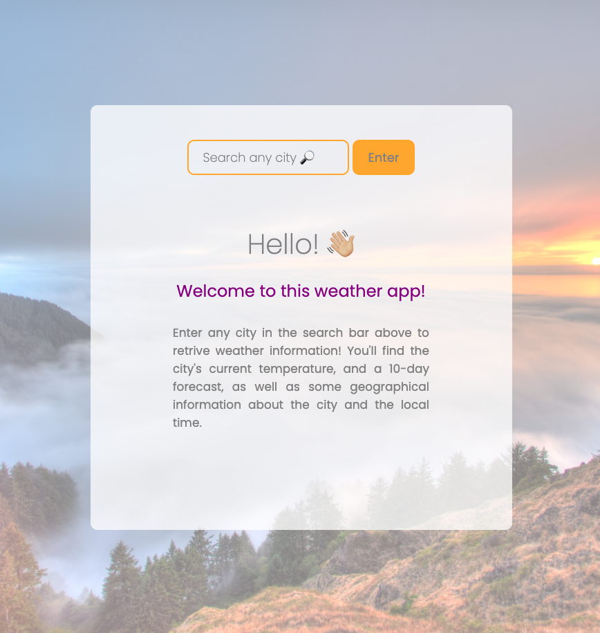
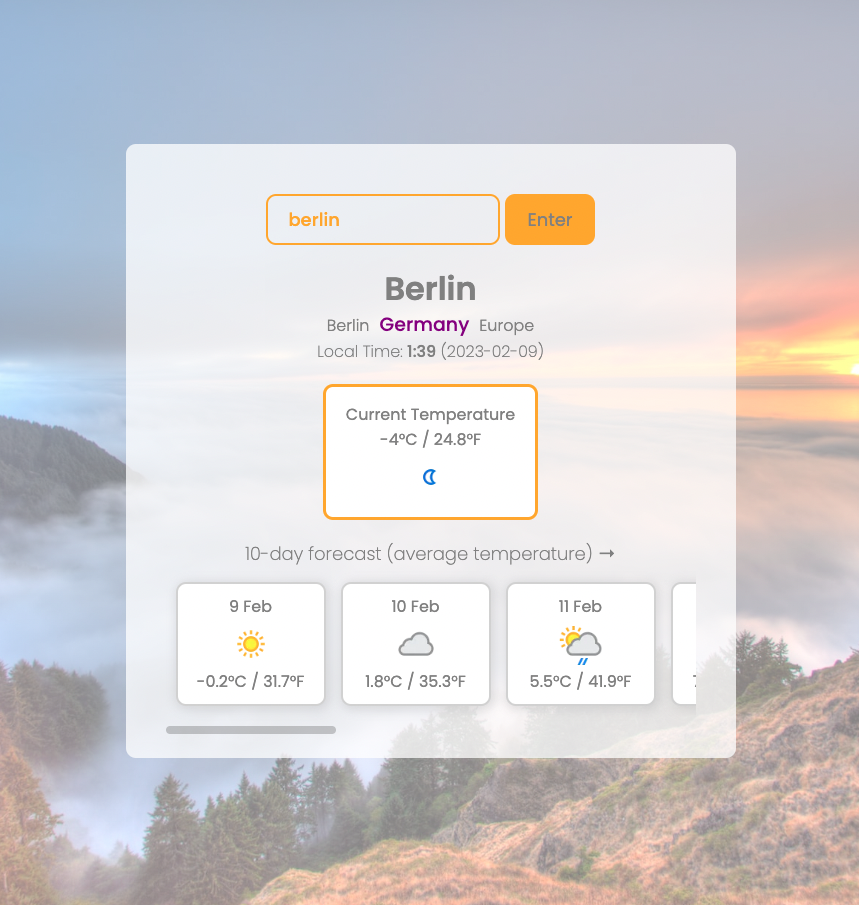

# Weather App

## Criteria:
Create a weather web app that provides the current weather and projected forecast for either a chosen location or the user’s current location.

## Implementation:
- I decided to use **NextJS** for this app, since it integrates a backend where the API key can be hidden from the browser/front-end, making the application more secure. NextJS also facilitates deployment with Vercel.
- This application takes a **user input** in the search bar (city or country name), and returns that location's **current weather** (temperature in °C and °F) and a **10-day forecast** (average temperature), as well as other city details like country, region, continent and local time and date.
- **Error handling** is also implemented so that the application doesn't crash if the API returns a bad response. If no input is supplied, or if the input is invalid (invalid city or typo), a front-end error message is displayed to the user, and the user can re-type an input in the search bar. See the error demo below.

### Tech Stack:
- NextJS with TypeScript
    - with ReactJS functional components
    - with the API logic stored in the back-end
- Sass (BEM) for styling
- Axios for request handling
- Vercel for deployment

## Delivery:
Access the [deployed application](https://weather-app-emilydaykin.vercel.app/).

  
  

#### Error demo

  

### Local installation
To run this application locally:
1. Clone this repo
2. Run `npm install`
3. Run `npm run dev`
